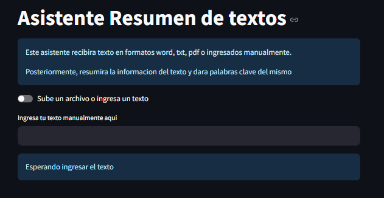
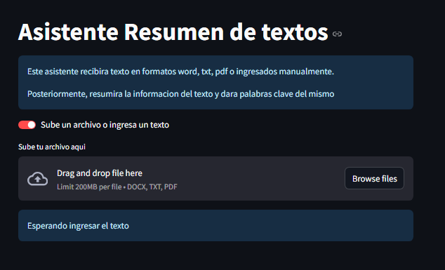
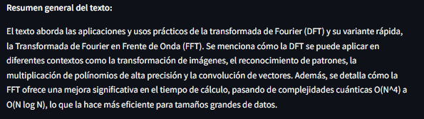
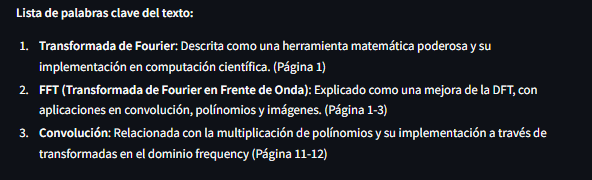

# Summary Agent

This program helps users summarize text from different sources, either from a file or manually entered text.

The output format of this agent is structured into sections:

1. Summary Section: Provides a condensed overview of the entire file or text.

2. Keywords Section: Extracts key terms from the text to enhance comprehension.

